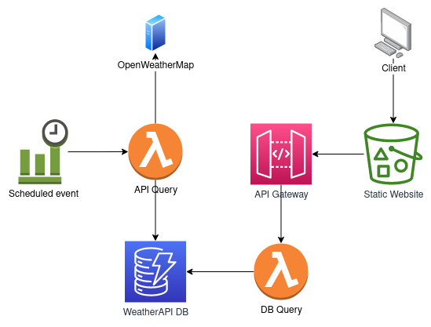

# Connecting to AWS services

## Description

This lab builds on a knowledge we have acquired in the previous labs and expands Lambda connectivity to leverage AWS services. We will learn how to use boto3 inside Lambda to make direct API requests to other AWS resources

Boto3 is an AWS SDK for Python and has a detailed documentation that describes every service that can be connected to
https://boto3.amazonaws.com/v1/documentation/api/latest/index.html

There are often two ways to use boto3 - clients and resources
https://www.learnaws.org/2021/02/24/boto3-resource-client/

Clients provide a low-level interface of AWS service and maps to an AWS CLI API call to the service

Resources are a higher-level abstractions providing object-oriented interface to AWS services.

Code using resources is generally simpler to read and we will be using this method in our labs, although AWS has started favouring client approach and is no longer adding new features to boto3 resources

## Architecture



The service conists of two parts, each of which is served by a separate Lambda

First we have an API Query Lambda that is triggered by a scheduled cron job. When called it connects to OpenWeatherMap API to retrieve current weather. The response is trimmed and saved to DynamoDB with a set expiration timestamp.

On the client side there is an S3 bucket that hosts a static single page website. When the site is loaded, a query is made to a Lambda function exposed through API Gateway. Lambda will retrieve weather data from DynamoDB and return parsed data to the static website, which will in turn render data using JS libraries

## Project code structure

### [weatherapi_api_query](weatherapi_api_query/index.py)

This Lambda retrieves current weather data from OpewWeatherMap API and stores results in a DynamoDB table. We are using boto3 resource to connect to a DynamoDB table and create a new record containing weather data

If we would like to have a short retention period for the data to save on storage costs and improve search time for a large set of data we can prune the database to delete old records from time to time. The manual approach is quite cumbersome, since we will need to create a separate function to parse all the data and delete records outside of our retention period. It could be quite slow, depending on amount of data we want to delete and might require multiple invocations to work around Lambda execution time limit

There is a more elegant solution where we specify expiration time for each record and enable automatic expiration on the DynamoDB table. This way we can automatically enforce data retention without adding complexity to our design

### [weatherapi_db_query](weatherapi_db_query/index.py)

This Lambda retieves data from DynamoDB and returns it as an HTTP response to a call made through API Gateway. A large part of the code is dealing with parsing the data and formatting it to be consumed by Plotly.js, but the important part that we are interested in is making a query to DynamoDB using a date index

Indexes are used by DynamoDB to identify search criteria that can be used efficiently to return data from the database. Think of it as a hash key that can return large amount of rows very quickly. If we attempt to search a DynamoDB table without using index, the response will be very slow, since DynamoDB will need to read every row and check the values we are searching for instead of retrieving it instantly from an optimized index

### [weatherapi_static_site](weatherapi_static_site/index.html)

We will use a static html page with embedded Plotly.js graph to display the weather data that is stored in DynamoDB. The static page can be served directly from an S3 bucket in our account and can be a quick way to build a prototype website using a minimal amount of effort

The webpage will make a call to an API Gateway URL that is generated by the Terraform, so there is a dependency that we will unfortunately have to satisfy manually in our lab. It may be possible to have a deployment that writes value of API Gateway URL to a local file and used a script to find and update it in the static website page before deploying it to S3, but that is quite complicated to cover in our lab so we will be updating it manually at a later stage

### [dynamodb.tf](dynamodb.tf)

In this module we will configure a DynamoDB table that will be used in our lab. A table can have one or more attribute and has to have a unique primary index, denoted by a hash key and secondary indexes that are used to optimize searches. Note that a record can have as many attributes as you want, as long as it also has attributes declared in table definition

We will be setting expiration on an attribute named ttl, which needs to be formatted as a unix timestamp. If the current timestamp is larger than the ttl of a record, DynamoDB will delete it automatically

Another useful attribute to keep in mind is lifecycle.prevent_destroy. This is an attribute used by Terraform rather than by DynamoDB and hightlights resources that should not be deleted even if we run Terraform destroy command.

Since we want to have our resources deleted after finishing the lab the value is set to false. If you consider deploying a production application through Terraform you might want to make sure that database is not deleted if you accidentally tear down the application

### [events.tf](events.tf)

In order to run a Lambda as a scheduled job, we will leverage EventBridge (previously Cloudwatch events). EventBridge can trigger a number of different services either on a cron schedule or when a specific event is detected. We will be using a cronjob schedule of every 5 minutes to call our Lambda

### [iam.tf](iam.tf)

The Lambdas in this lab will require a few more permissions than previously, since we would like to access DynamoDB tables, which is not allowed by a default IAM policy.

It is recommended for security purposes to scope permissions to the needs of the application so we'll create separate policies for reading from and writing to DynamoDB and attach them to corresponding Lambda functions

### [lambda.tf](lambda.tf)

Similar to previous Lambda modules, we will be deploying our Lambda functions and layers here. A few new parameters are used for addition of extra IAM policies granting Lambda functions access to DynamoDB

### [s3.tf](s3.tf)

S3 bucket is deployed and configured in this module. Since we would like to host a static website, we will need to make the bucket public and accessible to everyone. You should be careful exposing your S3 buckets to the public, since if you have any sensitive data stored in your bucket, anyone can read it. We only have a static page stored in our bucket, so it won't be a problem in our case

We also will upload a file to our bucket to be served as a static website. Since we will need to update this file manually and upload it a second time, we need to find a way to tell Terraform that the file has changed on disk and should be updated in S3. To do that, we calculate a hash of the file and provide it as an attribute, forcing Terraform to update the file everytime it changes

The output of the module will provide us with a public URL for the bucket, which we'll use to test our application

## Deployment

### Environment setup

As in the previous lab, Terraform will need to know which AWS profile to use when connecting to AWS API. Assuming you have installed your AWS CLI and configured access to your account described in the [setup part](../README.md)

```console
export AWS_PROFILE=<profile_name>
```
### Initialise Terraform providers

Similarly to previous example, we need to run Terraform init in this folder since each project has its own list of dependencies

```console
terraform init
```

### Fill out the config file

Make sure that you fill out the parameters in [prod.tfvars](prod.tfvars) with your values

* maintainer - your name
* weather_api_key - API key from your OpenWeatherMap account
* profile - name of AWS profile you have configured in ~/.aws/credentials
* static_s3_website_bucket - name of S3 bucket to host your website. This has to be unique across all of AWS account, so if you get a duplicate match, add some random letters to the bucket name
* expiration_sec - Default value is 86400 (one day) but you can experiment with your own values

### Apply changes

We may need to run the deploy a few times for this lab..

Deploy the changes to our target environment

```console
terraform apply -var-file prod.tfvars
```

You might get a failure first time around, since S3 bucket provisioning could take a bit longer and uploading an object immediately after will fail

If that happens, wait a bit and run the apply command again

Observe that the randomized URL of the API Gateway route is provided as an output from the apply command

```
Outputs:

api_gw_url = "https://abcdef123.execute-api.eu-west-1.amazonaws.com"
website_url = "..."
```

We will need to take the value of the API Gateway URL and update the [static site](weatherapi_static_site/index.html) <API_Gateway_URL> with this new value

After updating the static file, run the apply command one more time. This will upload the static website with correct URL and will provide us with a URL for the S3 static website

```
Outputs:

api_gw_url = "..."
website_url = "<bucket_name>.s3-website-eu-west-1.amazonaws.com"
```

### Test changes

Now we can navigate to the URL provided in the output to finally see the results of our lab

It may take some time to get the database populated, since the Lambda function runs every 5 minutes. In the meantime, feel free to explore DynamoDB that was created in this lab and see if you can retrieve items stored in database directly from AWS Console

### Teardown

After you have ensured that the deployment works, you can clean up the changes you deployed with the following command

    terraform destroy -var-file prod.tfvars
